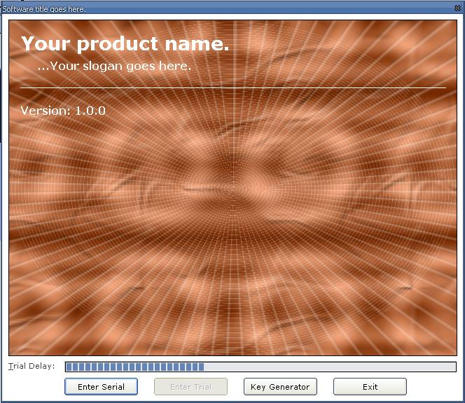



## Trial Registration System \(v2\)

### Description

..Trial Registration System (v2) a.k.a SimpleTrial is a good way to offer trial applications and add them to your projects, please vote, it uses two encryption formats, and it comes with a cool welcome screen with a trial delay and a cool splash image..
 
### More Info
 

             |
---                |---
**Submitted On**   |2004-04-26 11:52:06
**By**             |[Lee Cook](https://github.com/Planet-Source-Code/PSCIndex/blob/master/ByAuthor/lee-cook.md)
**Level**          |Intermediate
**User Rating**    |4.4 (35 globes from 8 users)
**Compatibility**  |VB 6\.0
**Category**       |[Miscellaneous](https://github.com/Planet-Source-Code/PSCIndex/blob/master/ByCategory/miscellaneous__1-1.md)
**World**          |[Visual Basic](https://github.com/Planet-Source-Code/PSCIndex/blob/master/ByWorld/visual-basic.md)
**Archive File**   |[Trial\_Regi1738644282004\.zip](https://github.com/Planet-Source-Code/lee-cook-trial-registration-system-v2__1-53453/archive/master.zip)

